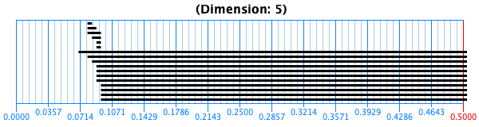

# Topology Homework 10/11
by Connor, Harry, and Jake

## Exercise 58
I ran the stream with the following parameters:

N = 10,000 (number of points)

n = 50 (number of landmark points)

maxDistance = 0.1

| k  | average num_simpleces |
|---|---|
| 1  | ~450  | 
| 2  | ~1,700 |
| 3 | ~9,500 |
| 4 | ~ 85,000 |

I ran the algorithm on each dimension 3 times and got the Betti profile correct every time.

For k=5, I had to reduce N to 5,000 for computational efficiency. Even with that reduction, there were on average 250,000 simpleces. I correctly recovered the betti profile each time.

For k=6, I had to reduce N to 1,000 for the program to run (resulting in on average 250,000) simpleces. I could not recover the Betti profile, instead having plots like this: 

We found $b_5$ to be very large but $b_6=0$, which is incorrect. 

Thus the biggest boundary seems to be just in computational power. If I had more processing power, I could use more than 1,000 points in 6 dimensions, and accurately recover the profile. 
